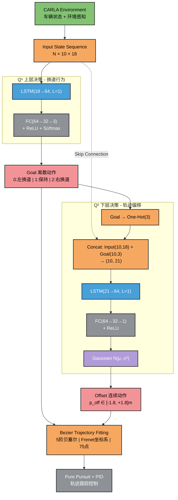

# 基于 LSTM 的分层强化学习自动驾驶系统

## 📋 项目简介

本项目实现了分层式深度强化学习决策架构(HDRL)，使用 LSTM 网络进行自动驾驶的轨迹规划与跟踪。最终在300步训练情况下达到收敛。

## 🎬 演示效果

### 场景1：town3多车博弈


### 场景2：town3轨迹追踪


### 场景3：town4高速路段


## 🚕 训练曲线


## 🏗️ 网络架构详解

**核心特性：**

- 🧠 双层决策网络：Q¹（离散换道决策）+ Q²（连续轨迹偏移）
- 🎯 5阶贝塞尔曲线轨迹规划（Frenet坐标系）
- 🚗 Pure Pursuit + PID 轨迹跟踪控制
- 🏋️ PPO 强化学习训练（on-policy）
- 🎮 CARLA 0.9.13 仿真环境

> tips:使用pid控制器是为了兼顾训练速度，部署时直接导出onnx文件接mpc控制器


**神经网络流程图：**




**🔍 网络模块详解**
1️⃣ 输入层（Input Layer）

```
维度： N × 10 × 18

N: Batch size
10: 序列长度（过去10个时间步）
18: 状态特征维度
状态特征（18维）：

[v_ego, lane_id, Δv₁, Δv₂, ..., Δv₈, Δd₁, Δd₂, ..., Δd₈]
v_ego: 自车速度（m/s）
lane_id: 当前车道ID
Δv₁~Δv₈: 8个感知区域的相对速度
Zone 1: LR (左后)
Zone 2: L (左侧)
Zone 3: LF (左前)
Zone 4: LS (左侧)
Zone 5: CF (中前)
Zone 6: RS (右侧)
Zone 7: RF (右前)
Zone 8: RR (右后)
Δd₁~Δd₈: 8个感知区域的相对距离（m）
```

2️⃣ Q¹ 网络 - 换道决策（Decision Model Q¹）
```
功能： 输出离散的换道决策

网络结构：

Input (N×10×18) 
  ↓
LSTM (hidden_size=64, num_layers=1)
  ↓
FC1 (64 → 32, ReLU)
  ↓
FC2 (32 → 3)
  ↓
Softmax
  ↓
Goal ∈ {0: 左换道, 1: 保持车道, 2: 右换道}
输出： 3维概率分布，采样得到离散动作
```
3️⃣ Q² 网络 - 轨迹偏移（Decision Model Q²）
```
功能： 输出连续的横向偏移量

网络结构：

Input (N×10×18) + Concat(Q¹ LSTM output)
  ↓
LSTM (hidden_size=64, num_layers=1)
  ↓
FC1 (64 → 32, ReLU)
  ↓
FC2 (32 → 3)
  ↓
Softmax → Offset
  ↓
Offset ∈ [-1.8, +1.8] meters
输出： 连续实数，表示在 Goal 基础上的精细调整

正值：向右偏移
负值：向左偏移
```
4️⃣ 轨迹生成模块（Trajectory Fitting）
```
输入： Goal（离散）+ Offset（连续）

处理流程：

graph LR
    A[Goal + Offset] --> B[计算目标 Frenet 坐标<br/>df = d₀ ± lane_width + offset]
    B --> C[5阶贝塞尔曲线拟合<br/>6个控制点]
    C --> D[Frenet → Cartesian<br/>坐标转换]
    D --> E[智能碰撞截断<br/>OBB预测]
    E --> F[Reference Trajectory<br/>75个采样点]
5阶贝塞尔控制点：

P₀ = d₀  (起点横向偏移)
P₁ = d₀  (保证 d'(0) = 0)
P₂ = d₀  (保证 d''(0) = 0)
P₃ = df  (保证 d''(1) = 0)
P₄ = df  (保证 d'(1) = 0)
P₅ = df  (终点横向偏移)

```

# 🚀 快速开始

**环境要求**

```
环境要求
Python 3.7
CARLA 0.9.13
PyTorch 1.10+
NumPy, Gym, Pygame
```

**训练模型**

**1. 启动 CARLA 服务器**
D:\CARLA_0.9.13\WindowsNoEditor\CarlaUE4.exe -RenderOffScreen

**2. 激活环境**
conda activate carla_rl

**3. 开始训练**
cd gym-carla
python train_hierarchical.py

**4. 断点续训**
python train_hierarchical.py --resume checkpoints/policy_iter300.pth
测试模型
**标准测试（20个episode）**
python test_hierarchical.py --ckpt checkpoints/best_policy.pth --episodes 20

**困难模式（更多障碍物）**
python test_hierarchical_hard.py --ckpt checkpoints/final_policy.pth --episodes 5

**TensorBoard 监控**
tensorboard --logdir=runs
浏览器访问 http://localhost:6006
